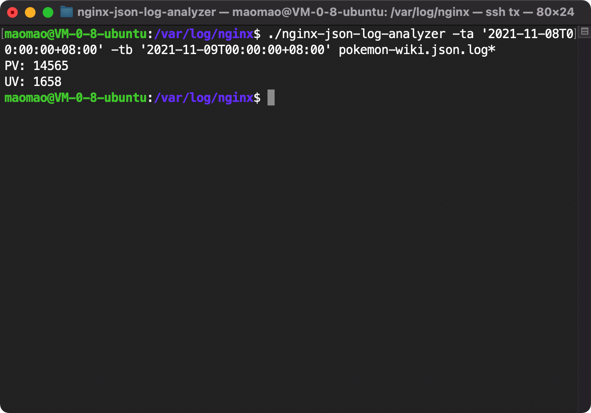
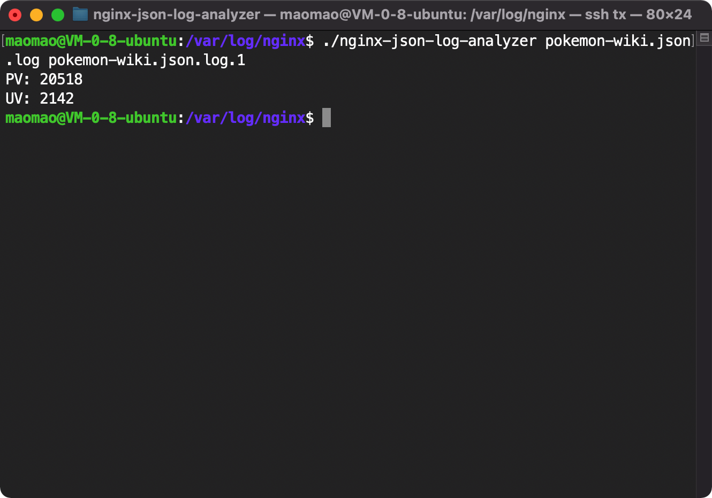
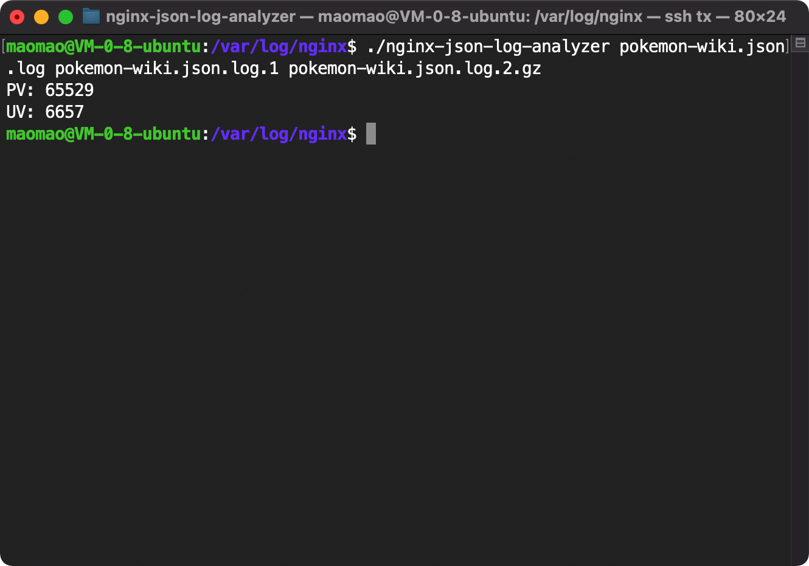
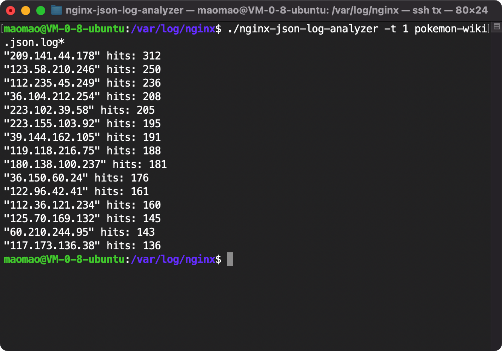
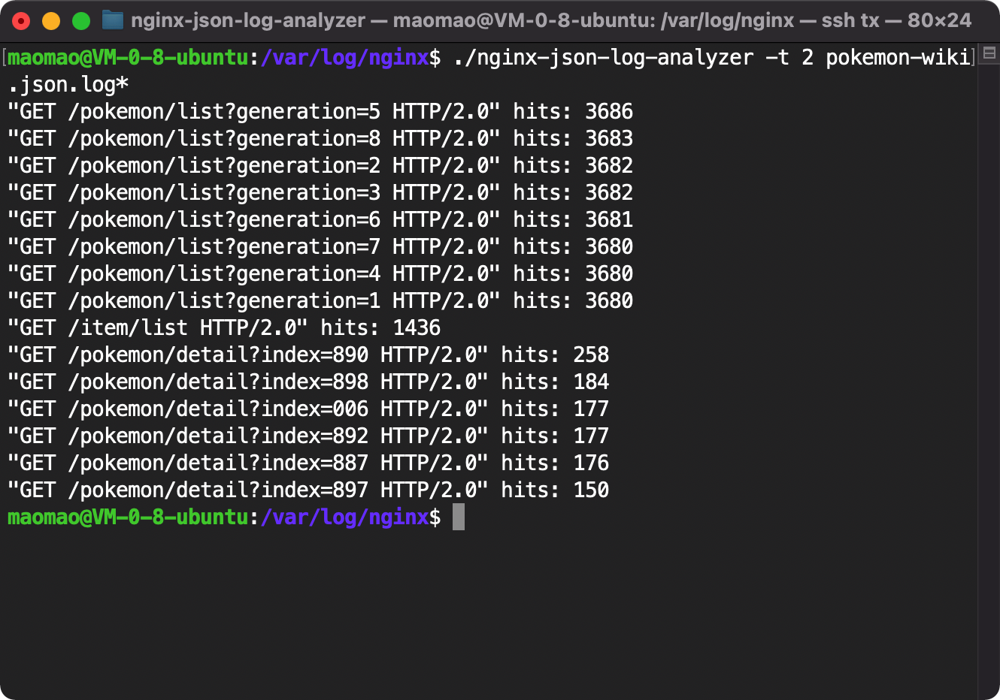
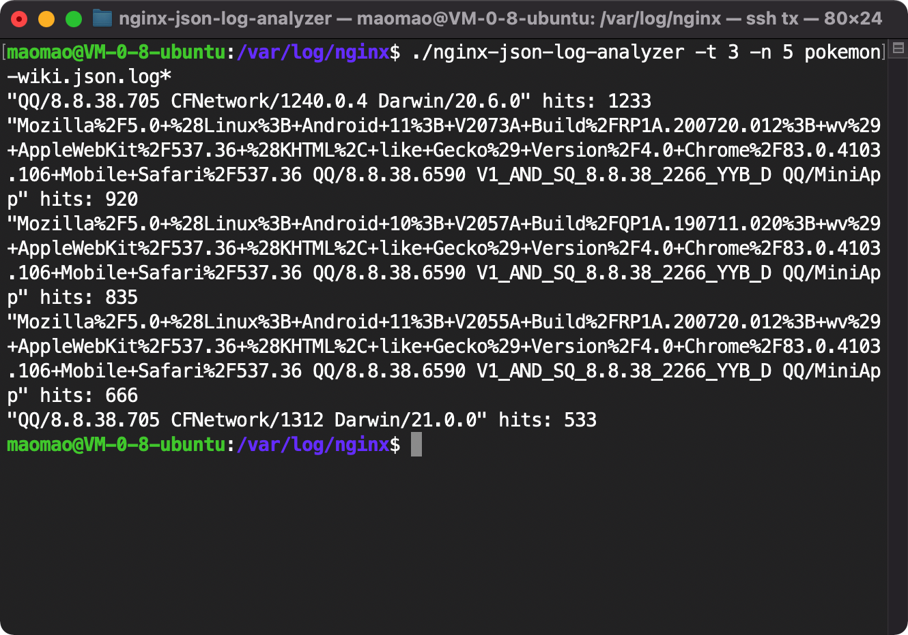
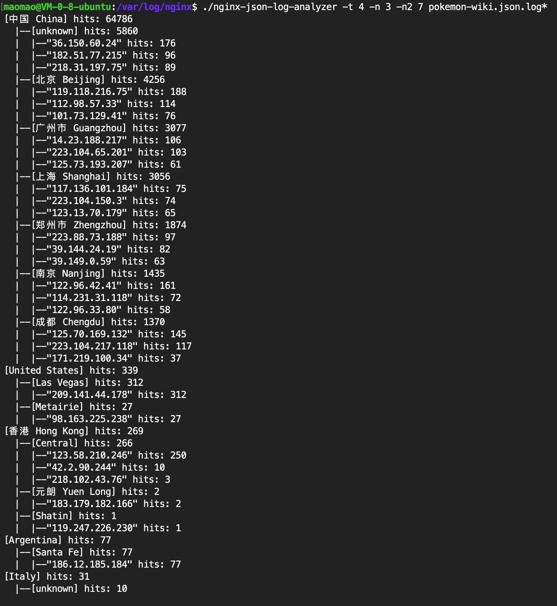
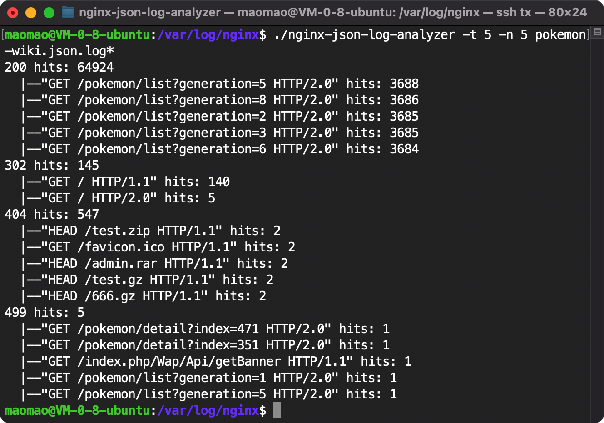
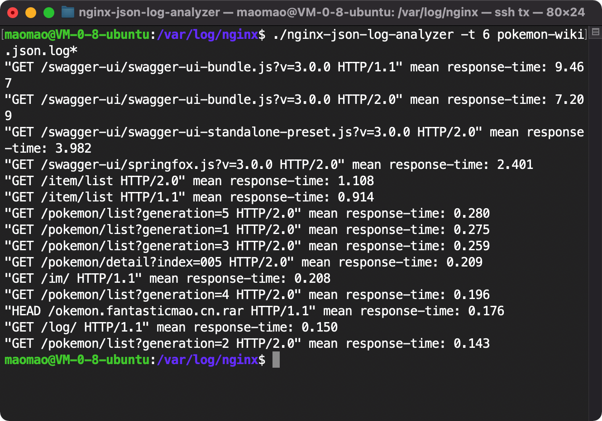
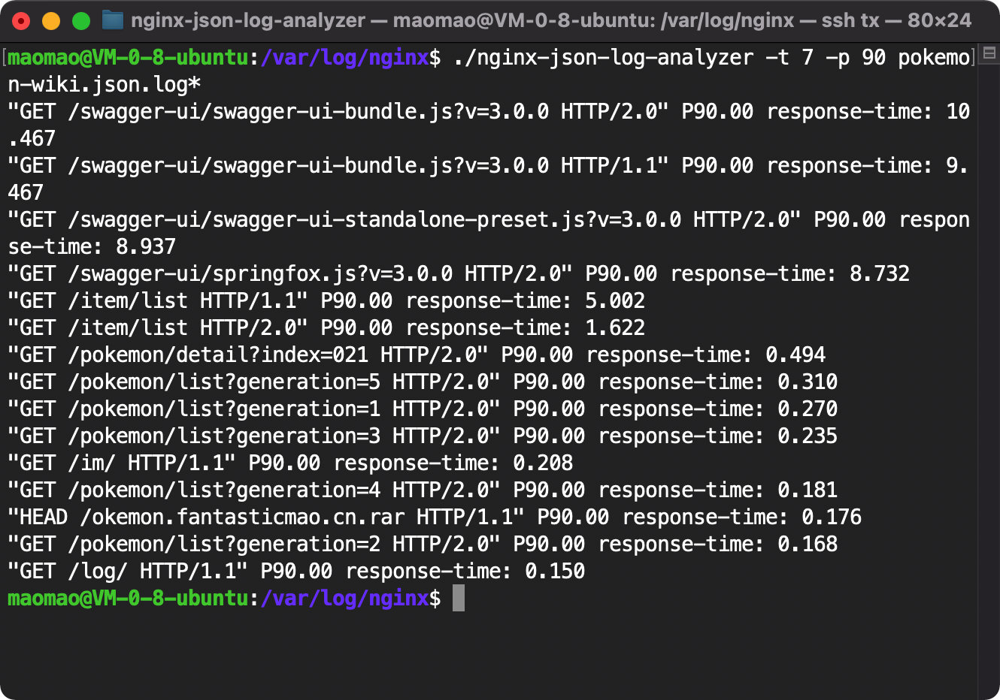

# Nginx-JSON-Log-Analyzer

[](https://github.com/fantasticmao/nginx-json-log-analyzer/actions)
[](https://codecov.io/gh/fantasticmao/nginx-json-log-analyzer)

[](https://goreportcard.com/report/github.com/fantasticmao/nginx-json-log-analyzer)
[](https://github.com/fantasticmao/nginx-json-log-analyzer/releases)
[](https://github.com/fantasticmao/nginx-json-log-analyzer/blob/main/LICENSE)

README [English](README.md) | [中文](README_ZH.md)

## 这是什么

Nginx-JSON-Log-Analyzer 是一个轻量的（简陋的）JSON 格式日志的分析工具，用于满足我自己对 Nginx 访问日志的分析需求。

Nginx-JSON-Log-Analyzer 采用 Go 语言来编写，运行时只需一个 2 MB 左右的可执行文件，目前支持的功能特性如下：

- [x] 基于请求时间过滤数据
- [x] 支持同时分析多个文件
- [x] 支持分析 .gz 压缩文件
- [x] 支持多种 [统计指标](#指定分析类型--t)

### 和 [GoAccess](https://goaccess.io/) 相比有什么优势

GoAccess 是一个优秀和强大的实时 web 日志分析工具，支持以命令行或者浏览器的两种交互方式。不过据我所知，GoAccess 似乎不支持按百分位统计 URI 响应时间，Nginx-JSON-Log-Analyzer 支持这个特性。

如果在开发 Nginx-JSON-Log-Analyzer 之前，我知道有 GoAccess 的话，可能我会直接使用它了。GoAccess 很强大，我爱 GoAccess。

### 和 [ELK](https://www.elastic.co/cn/what-is/elk-stack) 相比有什么优势

ELK 虽然功能强大，但安装和配置比较麻烦，对机器性能也有一定要求。Nginx-JSON-Log-Analyzer 更加轻量，使用起来更加简单，适用于一些简单的日志分析场景。

## 快速开始

### 下载安装

在 Nginx-JSON-Log-Analyzer 的 GitHub [Release](https://github.com/fantasticmao/nginx-json-log-analyzer/releases)
页面中，下载对应平台的二进制可执行文件即可。

#### GeoIP2 和 GeoLite2

[GeoIP2](https://www.maxmind.com/en/geoip2-city) 是商业版的 IP
地理定位的数据库，需要付费才能使用。[GeoLite2](https://dev.maxmind.com/geoip/geolite2-free-geolocation-data) 是免费版和低精度版的
GeoIP2，以 [署名-相同方式共享 4.0 国际](https://creativecommons.org/licenses/by-sa/4.0/deed.zh)
许可证发行，在 [MaxMind](https://www.maxmind.com/en/accounts/current/geoip/downloads) 官网登录即可下载。

在使用 Nginx-JSON-Log-Analyzer 时，如果需要解析 IP 的地理位置（即使用 `-t 4` 模式），则需要额外下载 GeoIP2 或者 GeoLite2
的城市数据库文件，保存至默认配置目录 `${HOME}/.config/nginx-json-log-analyzer/` 中的 `City.mmdb` 文件。对应的 shell 命令如下：

```shell
~$ mkdir -p ${HOME}/.config/nginx-json-log-analyzer
~$ tar -xzf GeoLite2-City_20211109.tar.gz
~$ cp GeoLite2-City_20211109/GeoLite2-City.mmdb ${HOME}/.config/nginx-json-log-analyzer/City.mmdb
```

### 配置 Nginx

Nginx-JSON-Log-Analyzer 仅支持解析 JSON 格式的 Nginx 访问日志，因此需要在 Nginx 配置中添加如下的 `log_format` 和 `access_log` 指令：

```text
log_format json_log escape=json '{"$time_local":"$time_local",'
                                '"remote_addr":"$remote_addr",'
                                '"request_time":$request_time,'
                                '"request":"$request",'
                                '"status":$status,'
                                '"body_bytes_sent":$body_bytes_sent,'
                                '"http_user_agent":"$http_user_agent"}';
access_log /path/to/access.json.log json_log;
```

- `log_format` 指令只能出现在 `http` 上下文中；
- `access_log` 指令可以出现在 `http`、`server`、`location` 等上下文中，并且需要使用如上声明的 `log_format`；
- 可以同时使用多个 `access_log` 指令，而不用删除原先已有的配置。例如：
    ```text
    access_log /path/to/access.log;
    access_log /path/to/access.json.log json_log;
    ```

相关文档: http://nginx.org/en/docs/http/ngx_http_log_module.html

### 命令行选项

#### 显示版本 -v

`-v` 选项依次显示 Nginx-JSON-Log-Analyzer 的构建版本、构建时间、构建时的 Git Commit。

#### 指定配置目录 -d

`-d` 选项可以指定 Nginx-JSON-Log-Analyzer 运行时需要的配置目录，默认的配置目录为 `${HOME}/.config/nginx-json-log-analyzer/`。

#### 指定分析类型 -t

`-t` 选项可以指定本次分析的类型，具体的分析类型和对应的统计指标如下表：

| 是否支持 | 分析类型 `-t` | 统计指标                                                           | 需要的字段或者依赖                                                                                                                                              |
| -------- | ------------- | ------------------------------------------------------------------ | --------------------------------------------------------------------------------------------------------------------------------------------------------------- |
| ✅       | 0             | PV 和 UV                                                           | $remote_addr                                                                                                                                                    |
| ✅       | 1             | 访问最多的 IP                                                      | $remote_addr                                                                                                                                                    |
| ✅       | 2             | 访问最多的 URI                                                     | $request                                                                                                                                                        |
| ✅       | 3             | 访问最多的 User-Agent                                              | $http_user_agent                                                                                                                                                |
| ✅       | 4             | 访问最多的国家和城市                                               | $remote_addr、MaxMind [GeoIP2](https://www.maxmind.com/en/geoip2-city) 或者 [GeoLite2](https://dev.maxmind.com/geoip/geolite2-free-geolocation-data) 城市数据库 |
| ✅       | 5             | 频率最高的响应状态码                                               | $status、$request                                                                                                                                               |
| ✅       | 6             | 最大 URI 平均响应时间                                              | $request、$request_time                                                                                                                                         |
| ✅       | 7             | 最大 URI 百分位响应时间，例如 P1(最小)，P50(中位)，P95，P100(最大) | $request、$request_time                                                                                                                                         |

#### 限制请求时间 -ta -tb

`-ta` 和 `-tb` 选项可以基于请求时间来过滤日志数据，`ta` 是 time after 的缩写，`tb` 是 time before 的缩写。

`-ta` 和 `-tb` 选项需要在 Nginx 的 `log_format` 中配置 $time_local 字段。

#### 限制输出行数 -n -n2

`-n` 和 `-n2` 选项可以限制 Nginx-JSON-Log-Analyzer 的输出行数，`-n2` 仅对 `-t 4` 模式生效。

#### 指定百分位值 -p

`-p` 选项可以指定 `-t 7` 模式中的百分位值，默认值为 95。

### 使用示例

#### 基于请求时间过滤数据



#### 同时分析多个文件



#### 分析 .gz 压缩文件



#### 统计访问最多的 IP



#### 统计访问最多的 URI



#### 统计访问最多的 User-Agent



#### 统计访问最多的国家和城市



#### 统计频率最高的响应状态码



#### 统计最大 URI 平均响应时间



#### 统计最大 URI P90 响应时间



## 常见的问题和回答

问：未来是否会支持实时解析？

答：不会支持。如果想要这个特性，建议使用 GoAccess、ELK、Grafana + 时序数据库之类的方案。

问：可以解析在 [配置 Nginx](#配置-Nginx) 之前的存量日志吗？

答：目前不可以。Nginx-JSON-Log-Analyzer 仅支持解析 JSON 格式的日志，未来可能会支持解析 combined 格式的日志。

## 版权声明

GeoLite2 Database [版权声明](https://dev.maxmind.com/geoip/geolite2-free-geolocation-data#license)

Nginx-JSON-Log-Analyzer [版权声明](https://github.com/fantasticmao/nginx-json-log-analyzer/blob/main/LICENSE)

Copyright (c) 2021 fantasticmao
